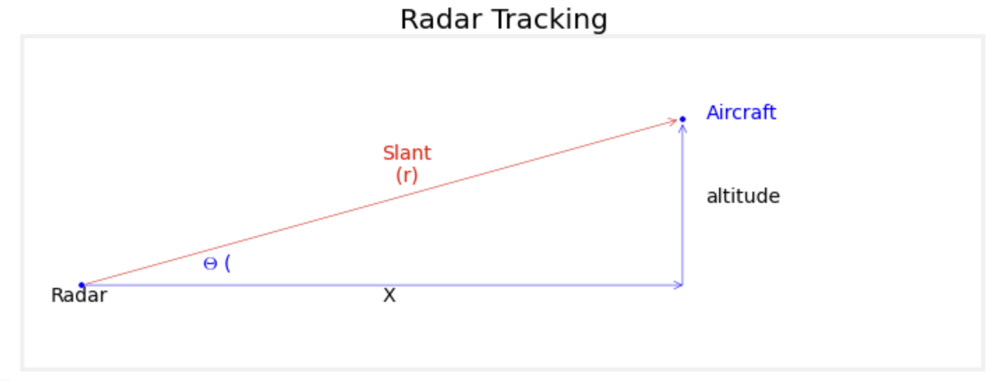

# Data assimilation med extended Kalman filter


## extended Kalman filter oppgave

Den sindige mannen frå oppgåve 1 tek ei pause i bilkøyringa.
Han observerer eit fly, med mykje dur og mange kanoner på. 
Mannen tenkjer som so at han helst ikkje vil møte på flyet frå nabolandet i aust.
Klok som han er lagar han difor følgjande modell for dynamikken til flyet:

- Mannen følgjer `x=[distanse, hastigheit, høgd]` (distance, velocity, altitude) for ulike tidspunkt.
- Frå standard fysikk har vi at rate of change for posisjon er eksakt lik hastigheiten
- Flyet prøvar å få oveblikk, og flyg difor med konstant hastigheit. Likevel så er der støy som gjer at hastigheiten blir forstyrra med bittelitt kvit støy. Hastigheiten er difor til ein viss grad ein random walk.
- Det same gjeld for høgd over havet: Den blir forsøkt haldt konstant, men grunna vind og luft-trykk etc. så blir denne også forstyrra av (Gaussisk) kvit støy.

1. Set opp differensiallikninga som er definert ovanfor. Dette er dog kanskje ikkje openbart, så sjå [her](https://github.com/Sonat-Consulting/kf-demo/blob/main/extended-kalman-filter/differential_model.png) dersom du vil ha løysinga.

2. Implementer update operator `H=I + J*dt` der `J` er `3x3` matrisen [her](https://github.com/Sonat-Consulting/kf-demo/blob/main/extended-kalman-filter/differential_model.png) som funne i 1.

Vi har vår dynamiske modell, og heldigvis har helten i historia også ein radar-type-ting!
Han nyttegjer denne, til å finne distansen (den skrå linja kalla "slant" i biletet under) til flyet kvart 0.05 sekund (`dt=0.05`) over ein periode på 20 sekund.

3. Målingane er å finne i fila `observed_flight_slant.csv`. Les desse inn.


Vår helt er uroleg. Kva om flyet kjem nermare og nermare? Dette må avgjerast! Istadenfor å springe så set han seg ned med penn og papir for å rekne, samt kode litt når den tid kjem.

4. Vi har ikkje direkte observasjonar av variablane distanse, høgde, eller hastigheit, men vi har målingar (slant distance) som er ein funksjon av to av elementa vi trackar for flyet. Nytt dine bortgjøymte Pytagoras-kunnskapar, og skriv ein funksjon som transformerer state `x` til slant distance! Kall funksjonen for `hx(x)` med argument `x`.
5. Du kjenner deg historisk betinga til å finn Jacobianen ved `x` av denne vyrde greske antikke funksjon `hx(x)`. Implementer ein funksjon ved navn `h_jacobian_at(x)` som returnerer Jacobianen ved state lik `x`.

Vår helt frydar seg! Ved å ta denne historiske detour innser han at han har alle ingrediensane til å implementere **extended Kalman filter**, for ein vyrdnad!

6. Implementer ein subklasse av `KalmanFilter` ved namn `ExtendedKalmanFilter`. Denne vyrde nye sub-klassen overskriv har følgjande attributes og metodar:
    - `h`: blir sett til `hx`
    - `h_jacobian_at_x` blir sett til `h_jacobian_at`
    - `predict_response()` overskriv variant i `KalmanFilter` (returnerer normalt `y_pred = H @ x`) ved å
         1. sette `H` til Jacobianen evaluert i beste estimat: `mu`
         2. returnere `h`evaluert i beste estimat: `mu` 

7. Initialiser ein instance av `ExtendedKalmanFilter` ved å nytte 
```
# prior
ekf.mu = np.array([-100, 200, 2000])
ekf.Sigma = np.eye(3)*50
# dynamisk støy
ekf.Q = array([[0, 0, 0],
              [0, 1, 0],
              [0, 0, 1]]) * 0.001
# Observasjonsfeil
ekf.Sigma_y = 50
```

8. Iterer over radar slant-målingar og kall `update()` og `predict()` iterativt for å assimilere informasjon og bringe den dynamiske modellen (og fordelingane) framover
9. Plot posterior estimat for `x` over tid saman med den sanne state som kan finnast i `true_flight_state`.
